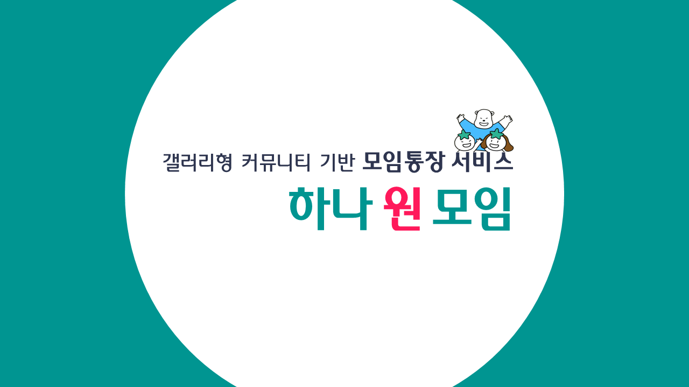
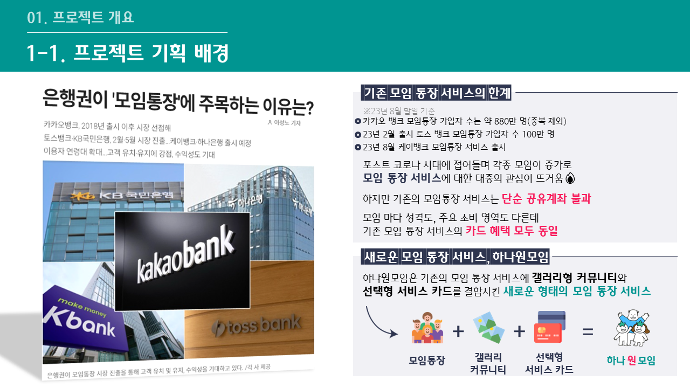
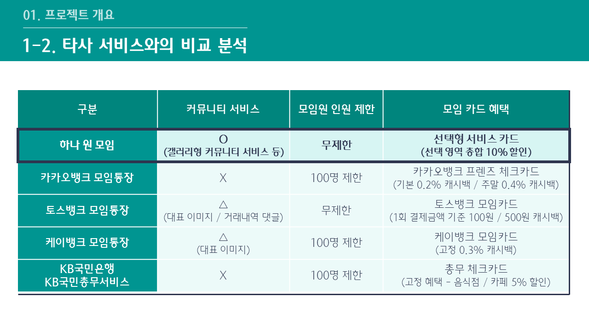
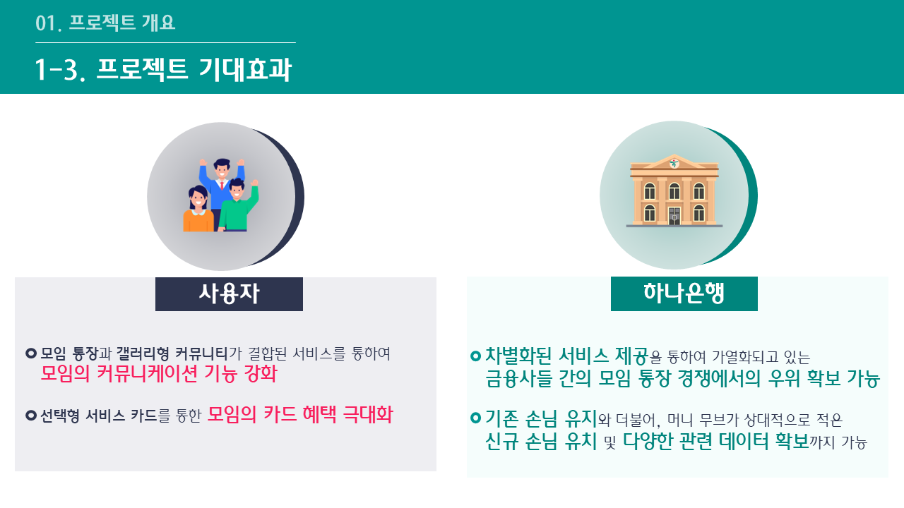
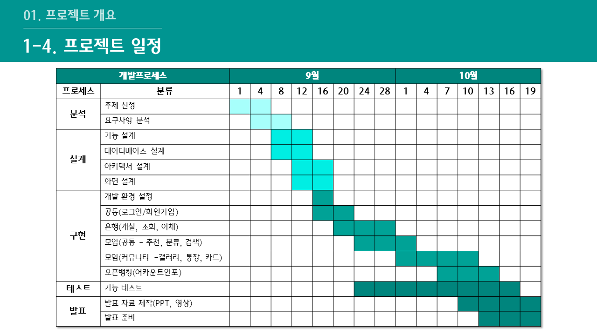
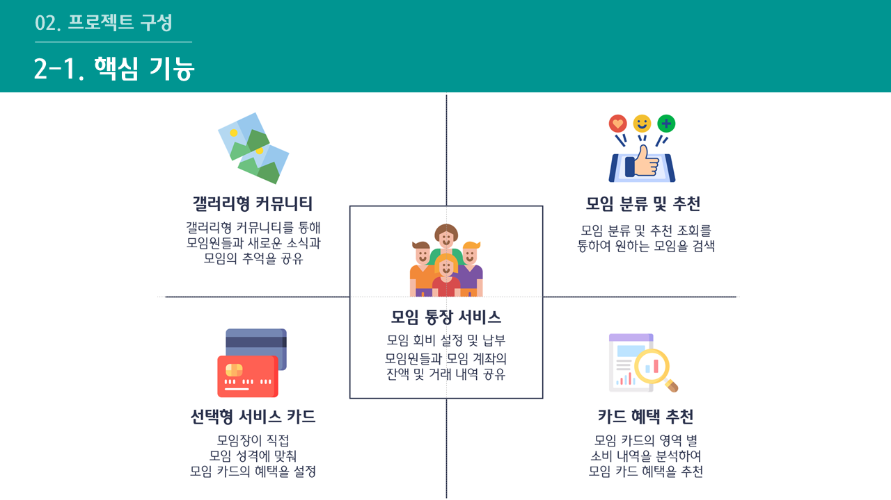
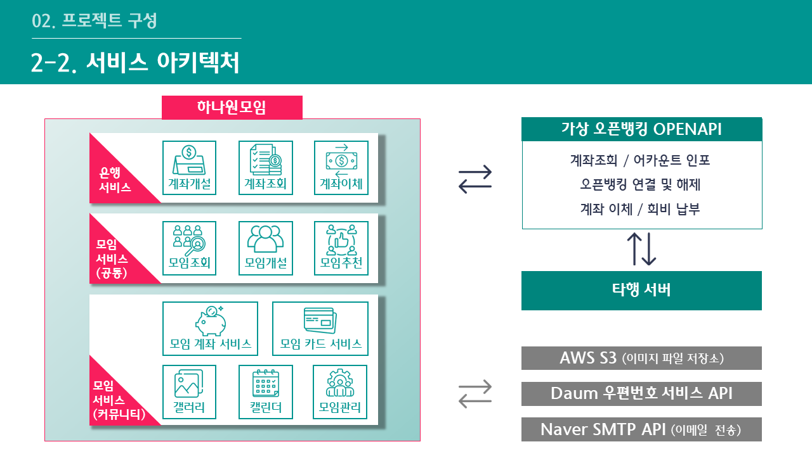
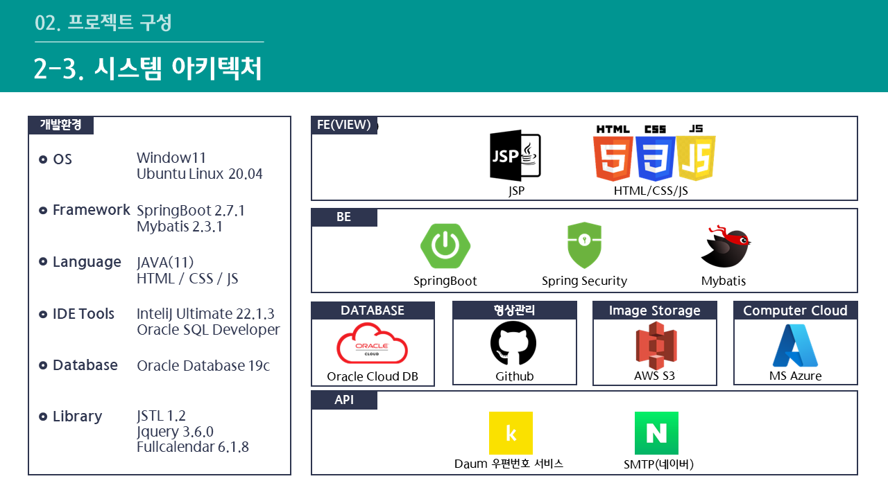
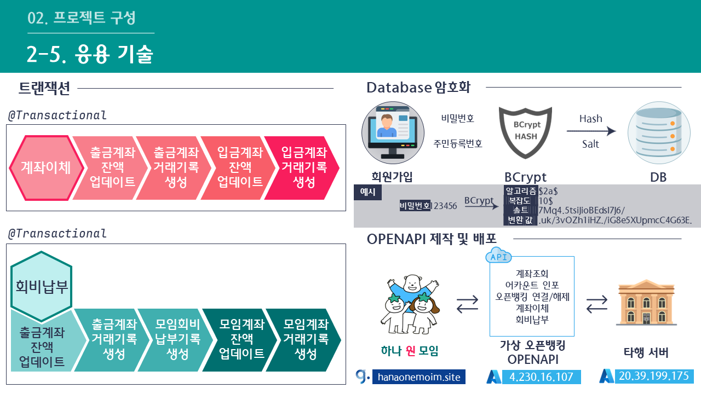
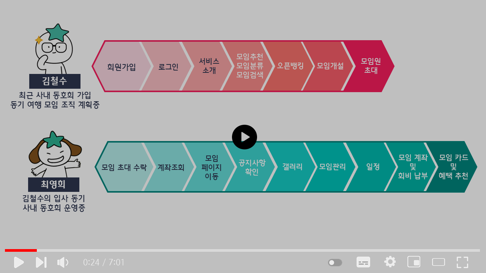

# 갤러리형 커뮤니티 기반 모임통장 서비스 하나원모임
[프로젝트 홈페이지](https://hanaonemoim.site)

# 1. 프로젝트 개요
## 1-1. 프로젝트 기획 배경

## 1-2. 타사 서비스와의 비교 분석

## 1-3. 프로젝트 기대효과

## 1-4. 프로젝트 일정

# 2. 프로젝트 구성 
## 2-1. 핵심 기능 

## 2-2. 서비스 아키텍처

## 2-3. 시스템 아키텍처

## 2-4. ERD 

## 2-5. 응용기술

# 3. 프로젝트 결과

## 3-1. 발표 ppt 
[발표 PPT](/project.pdf) 

## 3-2. 시연 영상 

# 4. 자기 소개
| 이름 | 김재영 |  |
| :--- | :--- | :--- |
| 메일 | <jy0511_@naver.com>  |  |
| Frontend Skill |  HTML, CSS, Javascript | |
| Backend Skill |  JAVA, Spring Boot, Oracle DBMS | |
| 자격증 | 정보처리기사(필기) | 2023.05 | 
|  | SQLD | 2022.12 | 
| 대외활동 | 한국폴리텍대학 광명융합기술교육원 프로젝트 경진대회 은상 | 2023.10 | 
| 교육이수사항 | 하나금융티아이 채용연계형 교육 1200시간   ( 한국폴리텍대학교 광명융합기술교육원 - 데이터분석과 ) | 2023.03 - 2023.10 | 
|  | 프로젝트 및 피어러닝 중심의 웹 개발 부트캠프 항해99 8기 1000시간   ( 스파르타코딩클럽 ) | 2022.06 - 2022.10 | 
